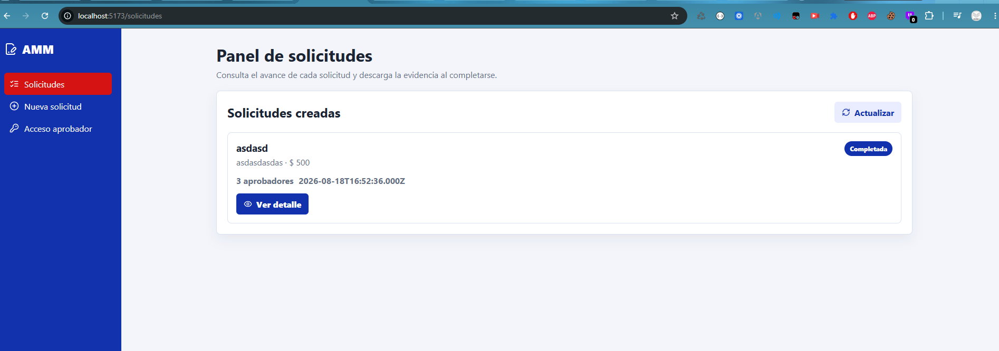
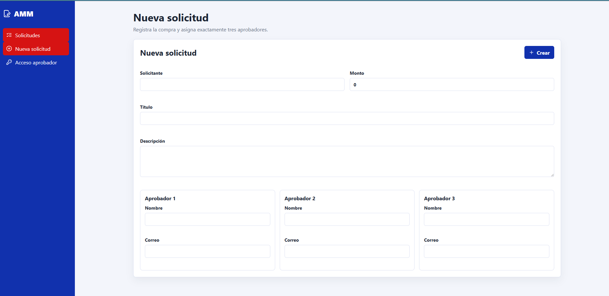
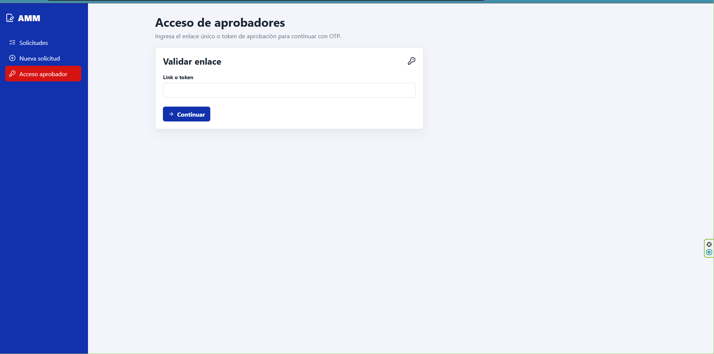

# AMM Solicitudes de Compra

Proyecto desarrollado para la prueba tecnica de AMM. La aplicacion permite crear solicitudes de compra, asignar tres aprobadores, validar cada aprobacion mediante OTP y generar un PDF de evidencia cuando todos los aprobadores firman.

## Tecnologias

- Node.js con Express y TypeScript
- Sequelize como ORM
- MySQL como base de datos
- React con TypeScript
- React Query para manejo de peticiones y cache
- Axios para consumo de API
- Zod para validacion de formularios y payloads
- PDFKit para generacion del PDF
- Swagger para documentacion de endpoints

## Capturas

### Panel de solicitudes



### Nueva solicitud



### Acceso aprobador



## Estructura Del Proyecto

```txt
backend/
  src/
    config/
    database/
    docs/
    modules/
      approvals/
      evidence/
      otp/
      requests/
    routes/
    shared/

frontend/
  src/
    api/
    components/
    features/
    pages/
    routes/
    schemas/
```

## Variables De Entorno

Backend: `backend/.env`

```env
NODE_ENV=development
PORT=4000
API_BASE_URL=http://localhost:4000
FRONTEND_URL=http://localhost:5173
DB_HOST=127.0.0.1
DB_PORT=3306
DB_NAME=amm_approval
DB_USER=root
DB_PASSWORD=
DB_LOGGING=false
PDF_STORAGE_DRIVER=local
PDF_LOCAL_DIR=storage/evidence
OTP_TTL_MINUTES=3
```

Frontend: `frontend/.env`

```env
VITE_API_URL=http://localhost:4000/api
```

## Instalacion

Instalar dependencias desde la raiz:

```bash
npm install
```

Crear los archivos `.env`:

```bash
cp backend/.env.example backend/.env
cp frontend/.env.example frontend/.env
```

En PowerShell:

```powershell
Copy-Item backend/.env.example backend/.env
Copy-Item frontend/.env.example frontend/.env
```

## Base De Datos

La base de datos usada es MySQL. Si se usa Docker:

```bash
docker compose up -d
```

Sincronizar tablas:

```bash
npm run db:sync --workspace backend
```

Tablas principales:

- `purchase_requests`
- `approvers`
- `otp_codes`

## Ejecucion

Backend:

```bash
npm run dev:backend
```

Frontend:

```bash
npm run dev:frontend
```

URLs locales:

- Frontend: `http://localhost:5173`
- Backend: `http://localhost:4000`
- Swagger: `http://localhost:4000/api/docs`
- Swagger JSON: `http://localhost:4000/api/docs.json`

## Flujo Funcional

1. El solicitante crea una solicitud de compra con titulo, descripcion, monto y tres aprobadores.
2. El backend genera un enlace unico para cada aprobador.
3. El aprobador ingresa al enlace y solicita un OTP.
4. El OTP tiene vigencia de 3 minutos.
5. Despues de validar el OTP, el aprobador puede aprobar o rechazar.
6. Al aprobar se registra nombre y fecha de firma.
7. Al rechazar la solicitud queda en estado rechazado.
8. Cuando los tres aprobadores firman, se genera un PDF de evidencia.
9. El solicitante puede descargar el PDF desde el detalle de la solicitud.

## Pantallas

- `/solicitudes`: panel con solicitudes creadas.
- `/solicitudes/nueva`: formulario para crear una solicitud.
- `/solicitudes/:id`: detalle de solicitud y estado de aprobadores.
- `/aprobacion`: acceso manual con enlace o token.
- `/aprobacion/:token`: vista del aprobador con OTP y decision.

## Endpoints

- `POST /api/solicitudes`
- `GET /api/solicitudes`
- `GET /api/solicitudes/{id}`
- `GET /api/solicitudes/{id}/evidencia.pdf`
- `GET /api/aprobaciones/{token}`
- `POST /api/aprobaciones/{token}/request-otp`
- `POST /api/aprobaciones/{token}/verify-otp`
- `POST /api/aprobaciones/{token}/approve`
- `POST /api/aprobaciones/{token}/reject`

## Manejo De Errores

El backend maneja los errores de forma centralizada. Todas las respuestas de error mantienen el mismo formato:

```json
{
  "success": false,
  "message": "OTP invalido o expirado",
  "code": "OTP_INVALID_OR_EXPIRED",
  "details": null
}
```

Se normalizan errores de validacion, reglas de negocio, recursos no encontrados y errores inesperados.

## Pruebas

Ejecutar pruebas con cobertura:

```bash
npm run test
```

Ejecutar build:

```bash
npm run build
```

Cobertura validada:

- Backend: superior al 60%
- Frontend: superior al 60%

## Notas De Implementacion

El envio de OTP esta simulado para facilitar las pruebas locales. El endpoint retorna el codigo generado; en un ambiente productivo se enviaria por correo o SMS y no se devolveria en la respuesta.

El PDF se guarda localmente en desarrollo. Para despliegue serverless en AWS, el servicio de evidencia puede adaptarse para guardar el archivo en S3 y exponer la descarga desde un bucket privado con URL firmada.
